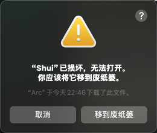

# Shui - Smart Drink Water Reminder

<p align="center">
  
  <br/>
</p>

A cross-platform desktop app focused on drink water reminders, caring for your health 💪 and improving your hydration habits.

## ✨ Features

- 🎯 Daily water intake goal setting
- 🖥️ Fullscreen reminders - Elegant and unmissable break notifications
- ⏰ Smart time management
  - Custom reminder intervals
  - Workday-only reminders
  - Custom time ranges
- 🔔 Multiple reminder modes
  - Fullscreen notification page
  - Native system notifications
  - Tray countdown display
  - Goal completion sound effects
- 💡 Smart and user-friendly
  - Automatic workday detection
  - Auto-pause when screen off/locked
  - Quick actions in tray
  - App whitelist (Default: Tencent Meeting, Zoom, Google Meet, Microsoft Teams)
- 📊 Data tracking
  - Daily water intake statistics
  - Hydration habit analysis
  - Break reminder statistics
  - Visual data dashboard

## 🖥 App Interface

<p align="center">
  
  <br/>
  
</p>

## 🚀 Getting Started

### Platform Support

- ✅ macOS
- 🚧 Windows (coming soon)
- 🚧 Linux (coming soon)

### Installation

Download latest version from [Releases](https://github.com/rock-zhang/Shui/releases/)

#### macOS

- Apple Silicon: Download `Shui_x.x.x_aarch64.dmg`
- Intel Chip: Download `Shui_x.x.x_x64.dmg`

#### Windows

- 64-bit: Download `Shui_x.x.x_x64-setup.exe`
- 32-bit: Download `Shui_x.x.x_x86-setup.exe`
- ARM64: Download `Shui_x.x.x_arm64-setup.exe`

#### Note



If seeing "Shui is damaged" warning on macOS, run:

```bash
sudo xattr -r -d com.apple.quarantine /Applications/Shui.app
```

## 🛣 Development Roadmap

### Implemented

- [x] Core reminder system
- [x] Custom intervals
- [x] Workday detection
- [x] System tray integration
- [x] Global hotkeys
- [x] App whitelist management

### Planned

- [ ] Custom notification sounds
- [ ] Advanced analytics
  - [ ] Hydration trends
  - [ ] Break time reports
  - [ ] Data export
- [ ] Theme customization
- [ ] Multilingual support

## 🛠 Tech Stack

- [Tauri](https://tauri.app/) - Cross-platform framework
- [Next.js](https://nextjs.org/) - React framework
- [React](https://reactjs.org/) - UI library
- [Rust](https://www.rust-lang.org/) - Backend logic
- [shadcn/ui](https://ui.shadcn.com/) - UI components

## 📝 License

MIT License © 2024 [Slash]
