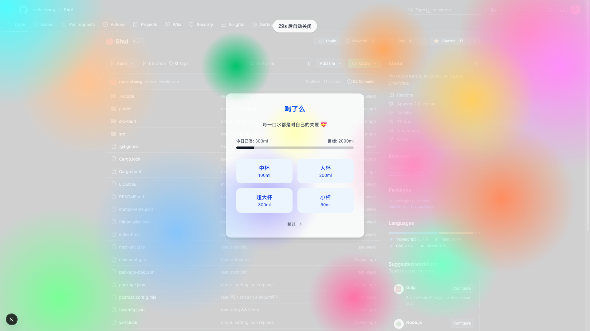

# Shui - 智能喝水提醒助手

  

一个专注喝水提醒的 macOS App，关注打工人健康 💪 ，改善你的喝水习惯。

## ✨ 主要特性

- 🎯 每日饮水目标设定
- ⏰ 智能时间管理
  - 自定义提醒间隔
  - 工作日智能提醒
  - 自定义时间范围
  - 锁屏自动暂停
- 🔔 多样化提醒方式
  - 系统原生通知
  - 托盘实时倒计时
  - 全局快捷键支持
- 💡 智能且人性化
  - 自动识别工作日
  - 锁屏智能暂停
  - 托盘快捷操作
  - 应用白名单（全屏游戏、视频时暂停提醒）
- 📊 数据统计
  - 每日饮水量统计
  - 休息提醒统计
  - 数据可视化展示

## 🖥 应用界面

  
   
  

## 🚀 开始使用

### 下载安装

从 [Releases](https://github.com/yourusername/shui/releases) 页面下载最新版本。

## 🛣 开发路线

### 已实现功能

- [x] 基础提醒功能
- [x] 自定义提醒间隔
- [x] 工作日智能提醒
- [x] 系统托盘支持
- [x] 全局快捷键

### 🛣 开发计划

- [ ] 自定义提醒音效
- [ ] 应用白名单管理
  - [ ] 自动识别全屏应用
  - [ ] 手动添加应用到白名单
  - [ ] 白名单应用运行时暂停提醒
- [ ] 数据统计与分析
  - [ ] 饮水量趋势图表
  - [ ] 休息时间统计
  - [ ] 数据导出功能
- [ ] 自定义主题
- [ ] 多语言支持

## 🛠 技术栈

- [Tauri](https://tauri.app/) - 跨平台桌面应用框架
- [Next.js](https://nextjs.org/) - React 应用框架
- [React](https://reactjs.org/) - 用户界面框架
- [Rust](https://www.rust-lang.org/) - 后端逻辑实现
- [shadcn/ui](https://ui.shadcn.com/) - UI 组件库

## 📝 License

MIT License © 2024 [Slash]
