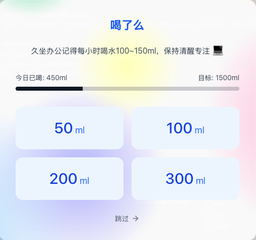
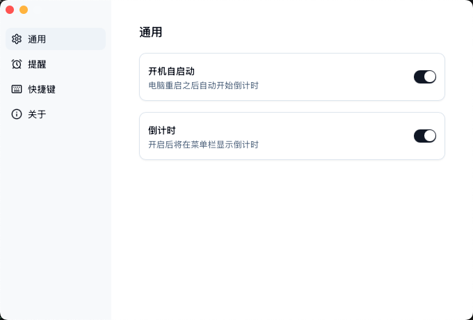
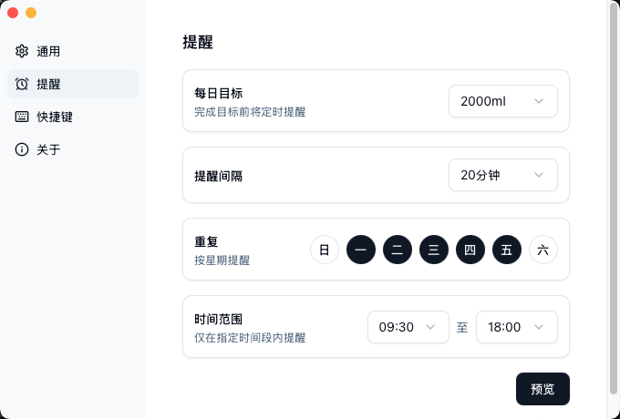
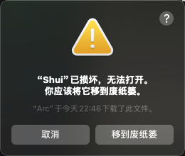
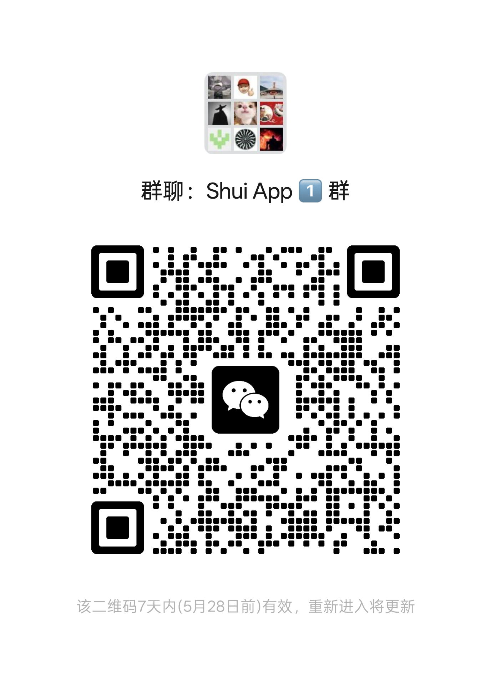

# Shui - 喝水提醒助手

<p align="center">
  
  <br/>
</p>

一个专注喝水提醒的跨端桌面 App，关注打工人健康 💪 ，改善你的喝水习惯。

## ✨ 主要特性

- 🎯 每日饮水目标设定
- 🖥️ 全屏提醒 - 优雅且不可忽视的休息提示
- ⏰ 智能时间管理
  - 自定义提醒间隔
  - 工作日智能提醒
  - 自定义时间范围
- 🔔 多样化提醒方式
  - 全屏通知页面
  - 系统原生通知
  - 托盘实时倒计时
  - 目标完成音效提醒
- 💡 智能且人性化
  - 自动识别工作日
  - 息屏、锁屏自动暂停
  - 托盘快捷操作
  - 应用白名单（默认：腾讯会议, Zoom, Google Meet, Microsoft Teams）
- 📊 数据统计
  - 每日饮水量统计
  - 饮水习惯分析
  - 休息提醒统计
  - 数据可视化展示

## 🖥 应用界面

<p align="center">
  
  <br/>
  
</p>

## 🚀 开始使用

### Platform Support

- ✅ macOS
- ✅ Windows
- 🚧 Linux (coming soon)
- 🚧 Android (coming soon)

### 下载安装

从 [Releases](https://github.com/rock-zhang/Shui/releases/) 页面下载最新版本。

#### macOS

- Apple Silicon：下载 `Shui_x.x.x_aarch64.dmg`
- Intel Chip：下载 `Shui_x.x.x_x64.dmg`

#### Windows

- 64 位系统：下载 `Shui_x.x.x_x64-setup.exe`
- 32 位系统：下载 `Shui_x.x.x_x86-setup.exe`
- ARM64 架构：下载 `Shui_x.x.x_arm64-setup.exe`

#### 注意



`macOS`下如果遇到`"Shui"已损坏，无法打开`的提示，请在终端运行

```shell
sudo xattr -r -d com.apple.quarantine /Applications/Shui.app
```

## 🛣 开发路线

### 已实现功能

- [x] 基础提醒功能
- [x] 自定义提醒间隔
- [x] 工作日智能提醒
- [x] 系统托盘支持
- [x] 全局快捷键
- [x] 应用白名单管理
- [x] 息屏、锁屏自动暂停
- [x] 托盘快捷操作
- [x] 自定义时间范围
- [x] 系统原生通知
- [x] 托盘实时倒计时

### 开发计划

- [x] Windows 适配
- [ ] 多语言支持
- [ ] Linux 适配
- [x] 提醒音效
- [ ] 数据统计与分析
  - [ ] 饮水量趋势图表
  - [ ] 休息时间统计
  - [ ] 数据导出功能
  - [ ] 饮水时间分布
  - [ ] 饮水时间间隔分析
- [ ] 自定义主题

## 🛠 技术栈

- [Tauri](https://tauri.app/) - 跨平台桌面应用框架
- [Next.js](https://nextjs.org/) - React 应用框架
- [React](https://reactjs.org/) - 用户界面框架
- [Rust](https://www.rust-lang.org/) - 后端逻辑实现
- [shadcn/ui](https://ui.shadcn.com/) - UI 组件库

## 社区交流

欢迎 PR 和 Issue，一起探讨和改进 Shui！
[](https://deepwiki.com/rock-zhang/Shui)
<picture>

  <source media="(prefers-color-scheme: dark)" srcset="public/qrcode_wechat_dark.png" />
  <source media="(prefers-color-scheme: light)" srcset="public/qrcode_wechat_light.png" />
  
</picture>

## ☕ 支持

如果你觉得本项目帮助到了你，请给作者一个免费的 Star，感谢你的支持！

## Star History

<a href="https://www.star-history.com/#rock-zhang/Shui&Date">
 <picture>
   <source media="(prefers-color-scheme: dark)" srcset="https://api.star-history.com/svg?repos=rock-zhang/Shui&type=Date&theme=dark" />
   <source media="(prefers-color-scheme: light)" srcset="https://api.star-history.com/svg?repos=rock-zhang/Shui&type=Date" />
   
 </picture>
</a>
